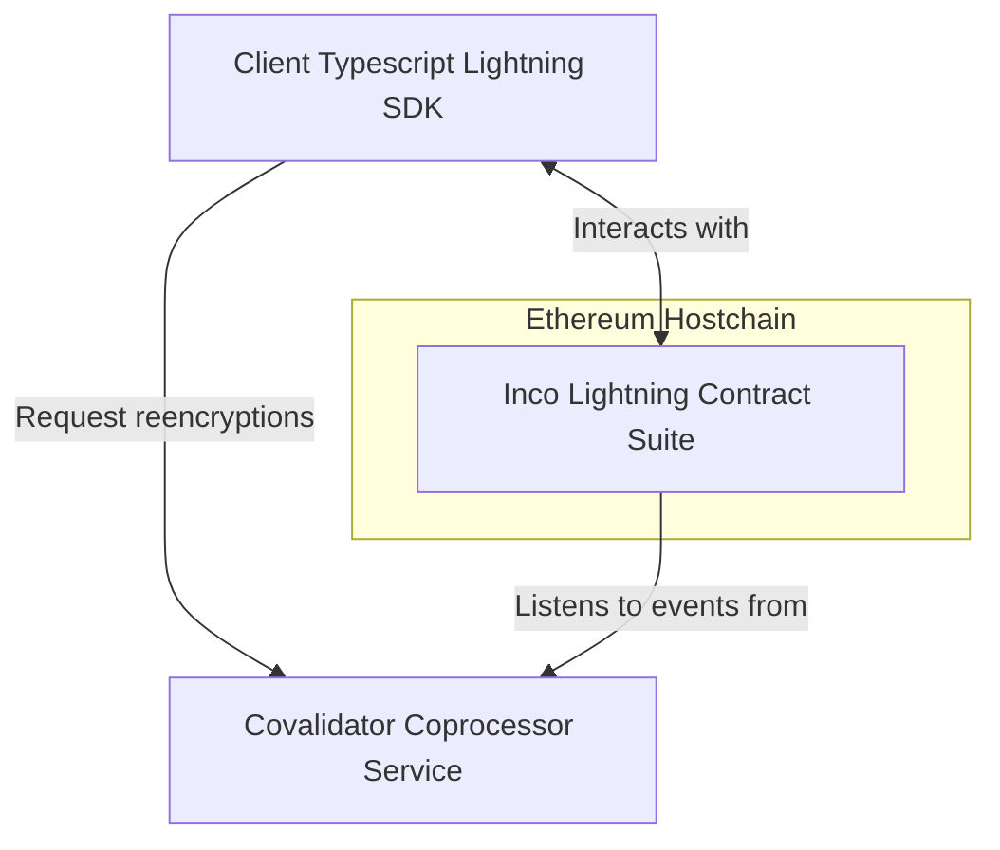

# Inco Lightning

Inco Lightning is a protocol for computing over confidential values on an Ethereum chain. This describes how to interact with confidentiality-enabled smart contracts using the [Inco Lightning JS SDK](https://www.npmjs.com/package/@inco/lightning-js).

With Inco Lightning you can compute over encrypted values without ever revealing them publicly. Later, the results of these computations can be revealed publicly via on-chain _decryption_ or requested privately to permitted users via off-chain _reencryption_.

Below we provide a brief overview of the Inco Lightning architecture, then we describe how to write a client application that interacts with the Inco Lightning contract suite and the covalidator coprocessor service.

Further details of our architecture can be found at our [Concepts Guide](https://docs.inco.org/guide/intro).

## Overview

Our system consists of three components:

1. The Ethereum host chain on which our protocol contracts are deployed and which maintains global state and consensus
2. Our Inco Lightning protocol contract that provides functions for encrypted computation and public decryption
3. Our Covalidator network that listens to Ethereum event, performs private computation, maintains a ciphertext store, and provides APIs for reencryption
4. Our Inco JS SDK that provides functionality for encrypted inputs and decrypting outputs via reencryption to expose private values belonging to a user privately


The process for developing a dapp with confidential compute is as follows:

**Provide a confidentiality-enabled smart contract**

- Write a smart contract that binds with the [Inco Lib](../node_modules/@inco/lightning/src/Lib.sol) smart contract accept encrypted inputs and compute over encrypted values
- Deploy that smart contract to an Ethereum chain (currently our testnet contract on Base Sepolia)

**Write a client application**

- Write a client-side Javascript/Typescript application using the Inco JS SDK
- Bind this application to the correct Covalidator servicing the Inco Lightning contract suite
- Interact with the contract using standard Ethereum tooling such as [Viem](https://viem.sh/)

**Compute over encrypted values**

- We can use the Inco JS SDK to send user-provided inputs as encrypted values
- The contract may perform compute on-chain with standard Solidity function calls into our library mixed with ordinary Solidity logic and state
- Values are manipulated via immutable refer

**Reveal values via on-chain decryption**
- A dapp contract may request a decryption of a handle via an on-chain decryption request. Our covalidators will process this request via an Ethereum event and post the decrypted plaintext back on chain

**Access values by off-chain reencryption**
- A user that is permitted to access an encrypted handle to a value (mediated by an on-chain access control contract) is able to obtain the decrypted value corresponding to the handle off-chain via a bilateral interaction with our covalidators.

## Client-side usage

The client side of this flow is handled by the `Lightning` client from the Inco Lightning JS SDK. Encrypted inputs are produced with `lightning.encrypt(...)`, and a handle's value is retrieved off-chain with `lightning.attestedDecrypt(...)`, which asks the covalidators to authenticate the request and return the attested plaintext for a wallet-authorized caller.

```typescript
import { handleTypes } from '@inco/lightning-js';
import { Lightning } from '@inco/lightning-js/lite';
import { createWalletClient, http } from 'viem';
import { privateKeyToAccount } from 'viem/accounts';

// Bind to a deployment.
const lightning = await Lightning.baseSepoliaTestnet();

const account = privateKeyToAccount(privateKey);
const walletClient = createWalletClient({
  chain, // a viem Chain for the host chain, e.g. Base Sepolia
  transport: http(hostChainRpcUrl),
  account,
});

// Encrypt an input for a call into the dapp contract.
const ciphertext = await lightning.encrypt(value, {
  accountAddress: walletClient.account.address,
  dappAddress,
  handleType: handleTypes.euint256,
});

// ... send `ciphertext` in a transaction to the dapp contract, which returns a `handle` ...

// Reveal the value behind a handle off-chain.
const decrypted = await lightning.attestedDecrypt(walletClient, [handle]);
const plaintext = decrypted[0]?.plaintext?.value;
```

- `Lightning.baseSepoliaTestnet()`, `Lightning.baseMainnet()`, and `Lightning.localNode(pepper)` bind a `Lightning` client to a specific deployment.
- `lightning.encrypt(value, { accountAddress, dappAddress, handleType })` encrypts a value for a specific dapp contract and returns the ciphertext to submit on-chain. `handleType` comes from `handleTypes`, exported from `@inco/lightning-js`.
- `lightning.attestedDecrypt(walletClient, [handle])` requests an attested, authenticated decryption of one or more handles from the covalidators and returns an array of results, with each plaintext at `result[0]?.plaintext?.value`. The SDK also supports reencryption modes for callers that need the value re-encrypted rather than returned in plaintext: one returns it re-encrypted for a delegate, and another re-encrypts it for local decryption by the caller.
